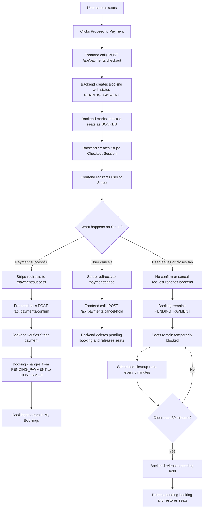

# CineBook Payment Flow Review Script

## 1. Opening Summary

Today I will explain how the CineBook payment flow works from frontend to backend.

The application uses Stripe Hosted Checkout. That means our frontend does not collect or process card details. The frontend only sends the selected show and seats to our backend. The backend creates a temporary booking, creates a Stripe Checkout Session, and redirects the user to Stripe.

There are three possible outcomes:

1. The user completes payment.
2. The user cancels payment.
3. The user leaves the payment incomplete.

The important part is that seats are temporarily held while payment is in progress, and if payment is not completed, the backend later releases those seats automatically.

## 2. Simple End-to-End Flow



## 3. Frontend Payment Start

The payment starts from the booking page after the user selects seats and clicks Proceed to Payment.

File:

```text
frontend/src/app/features/user/booking/booking.ts
```

The important method is `confirm()`.

It sends this payload to the backend:

```json
{
  "showId": 12,
  "seatLabels": ["A1", "A2"]
}
```

The frontend calls:

```ts
this.paymentService
  .startCheckout({ showId: show.id, seatLabels: this.selectedSeats() })
  .subscribe({
    next: (res) => {
      window.location.href = res.checkoutUrl;
    }
  });
```

So the frontend does two things:

1. It asks the backend to start checkout.
2. It redirects the browser to the Stripe Checkout URL returned by the backend.

The API wrapper is in:

```text
frontend/src/app/core/services/payment.service.ts
```

```ts
startCheckout(payload: BookingCreatePayload): Observable<CheckoutResponse> {
  return this.http.post<CheckoutResponse>(`${this.base}/checkout`, payload);
}
```

## 4. Backend Checkout Endpoint

The backend receives the checkout request in:

```text
backend/src/main/java/com/cinebook/controller/PaymentController.java
```

Endpoint:

```text
POST /api/payments/checkout
```

Controller method:

```java
@PostMapping("/checkout")
public ResponseEntity<CheckoutResponse> checkout(
        @Valid @RequestBody BookingRequest request,
        @AuthenticationPrincipal AuthPrincipal principal) {
    return ResponseEntity.ok(paymentService.startCheckout(principal.userId(), request));
}
```

The frontend does not send `userId`. The backend takes the user ID from the authenticated JWT principal. This is safer because the client cannot pretend to book for another user.

## 5. Backend Creates a Pending Booking

The actual seat hold is created in:

```text
backend/src/main/java/com/cinebook/service/BookingService.java
```

Method:

```java
holdSeats(Long userId, BookingRequest request)
```

This method:

1. Loads the selected show.
2. Normalizes seat labels.
3. Rejects duplicate or already booked seats.
4. Calculates subtotal, tax, and total.
5. Creates a booking with status `PENDING_PAYMENT`.
6. Creates `BookingSeat` rows with status `BOOKED`.
7. Reduces `show.availableSeats`.

The key line is:

```java
booking.setStatus(BookingStatus.PENDING_PAYMENT);
```

This means the booking exists, but payment is not completed yet.

The selected seats are also stored as `BOOKED`:

```java
seat.setStatus(SeatStatus.BOOKED);
```

This blocks other users from taking the same seats while the payment is in progress.

## 6. Backend Creates Stripe Checkout Session

After holding the seats, the backend creates the Stripe Checkout Session in:

```text
backend/src/main/java/com/cinebook/service/StripePaymentService.java
```

Method:

```java
startCheckout(Long userId, BookingRequest request)
```

Important logic:

```java
Booking booking = bookingService.holdSeats(userId, request);
Session session = gateway.createCheckoutSession(amountMinor, productName, booking.getId());
booking.setStripeSessionId(session.getId());
bookingRepository.save(booking);
return new CheckoutResponse(session.getUrl(), booking.getId());
```

At this point:

1. The pending booking is saved.
2. The selected seats are blocked.
3. The Stripe session ID is saved on the booking.
4. The frontend receives the Stripe Checkout URL.

The Stripe-specific code is in:

```text
backend/src/main/java/com/cinebook/service/StripeGateway.java
```

It sets:

```java
.setSuccessUrl(props.getSuccessUrl() + "?session_id={CHECKOUT_SESSION_ID}")
.setCancelUrl(props.getCancelUrl() + "?session_id={CHECKOUT_SESSION_ID}")
```

So Stripe knows where to send the user after success or cancellation.

## 7. Successful Payment Flow

If the user pays successfully, Stripe redirects to:

```text
/payment/success?session_id=...
```

Frontend file:

```text
frontend/src/app/features/user/payment-success/payment-success.ts
```

The frontend reads `session_id` and calls:

```ts
this.paymentService.confirm(sessionId)
```

That sends:

```text
POST /api/payments/confirm
```

Backend file:

```text
backend/src/main/java/com/cinebook/service/StripePaymentService.java
```

Method:

```java
finalizeBySession(Long userId, String sessionId)
```

This method:

1. Finds the booking by `stripeSessionId`.
2. Verifies that the booking belongs to the logged-in user.
3. Retrieves the Stripe session.
4. Checks that `paymentStatus` is `paid`.
5. Finalizes the booking.

Then `BookingService.finalizePending()` changes:

```text
PENDING_PAYMENT -> CONFIRMED
```

It also saves:

1. `stripePaymentIntentId`
2. `paidAt`

The payment intent ID is important because it is later used if a refund is needed.

## 8. User Cancels Payment

If the user clicks cancel on Stripe, Stripe redirects to:

```text
/payment/cancel?session_id=...
```

Frontend file:

```text
frontend/src/app/features/user/payment-cancel/payment-cancel.ts
```

The frontend calls:

```ts
this.paymentService.cancelHold(sessionId)
```

That sends:

```text
POST /api/payments/cancel-hold
```

Backend file:

```text
backend/src/main/java/com/cinebook/service/StripePaymentService.java
```

Method:

```java
cancelHold(Long userId, String sessionId)
```

This finds the booking by Stripe session ID and calls:

```java
bookingService.releasePending(booking.getId());
```

`releasePending()` only works if the booking is still `PENDING_PAYMENT`. It deletes the temporary booking and releases the blocked seats.

## 9. User Leaves Without Paying

This is the incomplete payment case.

The user may:

1. Close the Stripe tab.
2. Lose internet.
3. Leave the page open without paying.
4. Close the browser.

In this case, no frontend code runs.

That means:

1. `/payment/success` is not opened.
2. `/payment/cancel` is not opened.
3. `/api/payments/confirm` is not called.
4. `/api/payments/cancel-hold` is not called.

So the backend booking remains:

```text
PENDING_PAYMENT
```

The seats also remain temporarily blocked because their `BookingSeat` rows are still `BOOKED`.

This is why the cleanup job is needed.

## 10. Automatic Cleanup for Incomplete Payments

Scheduling is enabled in:

```text
backend/src/main/java/com/cinebook/CineBookApplication.java
```

```java
@EnableScheduling
```

The cleanup job is in:

```text
backend/src/main/java/com/cinebook/service/StripePaymentService.java
```

Method:

```java
reapAbandonedHolds()
```

Code:

```java
@Scheduled(fixedDelay = 300_000L) // every 5 minutes
@Transactional
public void reapAbandonedHolds() {
    LocalDateTime cutoff = LocalDateTime.now().minusMinutes(props.getHoldTtlMinutes());
    List<Booking> stale =
            bookingRepository.findByStatusAndBookingDateBefore(BookingStatus.PENDING_PAYMENT, cutoff);
    for (Booking booking : stale) {
        bookingService.releasePending(booking.getId());
    }
}
```

This job runs every 5 minutes.

It calculates:

```text
cutoff = current time - hold TTL
```

The hold TTL is configured in:

```text
backend/src/main/resources/application.properties
```

```properties
app.stripe.hold-ttl-minutes=30
```

So if the current time is 10:40, the cutoff is 10:10.

The job finds all bookings where:

```text
status = PENDING_PAYMENT
booking_date < cutoff
```

In simple words:

Find all unpaid bookings older than 30 minutes.

## 11. Releasing the Pending Hold

The cleanup job calls:

```java
bookingService.releasePending(booking.getId());
```

That method is in:

```text
backend/src/main/java/com/cinebook/service/BookingService.java
```

It does this:

```java
Booking booking = bookingRepository.findById(bookingId).orElse(null);
if (booking == null || booking.getStatus() != BookingStatus.PENDING_PAYMENT) {
    return;
}

List<BookingSeat> seats = bookingSeatRepository.findByBookingId(bookingId);
int releaseCount = (int) seats.stream()
        .filter(s -> s.getStatus() == SeatStatus.BOOKED).count();

bookingSeatRepository.deleteAll(seats);
bookingRepository.delete(booking);
```

Then it restores the available seats:

```java
show.setAvailableSeats(Math.min(avail + releaseCount, cap));
showRepository.save(show);
```

So cleanup means:

1. Check booking is still `PENDING_PAYMENT`.
2. Count the held seats.
3. Delete the `booking_seats`.
4. Delete the pending booking.
5. Add those seats back to `show.availableSeats`.

Confirmed bookings are safe because `releasePending()` returns immediately unless the booking status is exactly `PENDING_PAYMENT`.

## 12. Webhook Backup

There is also a Stripe webhook path.

Endpoint:

```text
POST /api/payments/webhook
```

If Stripe sends:

```text
checkout.session.completed
```

The backend finalizes the booking.

If Stripe sends:

```text
checkout.session.expired
```

The backend releases the pending hold.

So the cleanup has two backup mechanisms:

1. Stripe webhook for session completed or expired.
2. Scheduled cleanup every 5 minutes for abandoned pending bookings.

## 13. Final Review Summary

The payment flow is designed to protect seat availability.

When payment starts, the backend creates a temporary `PENDING_PAYMENT` booking and marks seats as `BOOKED`. This prevents double booking while the user is on Stripe.

If payment succeeds, the backend verifies the Stripe session and changes the booking to `CONFIRMED`.

If the user cancels, the backend deletes the pending booking and releases the seats.

If the user leaves without paying, no frontend request reaches the backend. The booking stays `PENDING_PAYMENT`, but the scheduled cleanup job runs every 5 minutes. Once the booking is older than 30 minutes, it deletes the pending booking and releases the seats.

So the system handles all three cases:

1. Paid: confirm booking.
2. Cancelled: release immediately.
3. Abandoned: release automatically after TTL.
